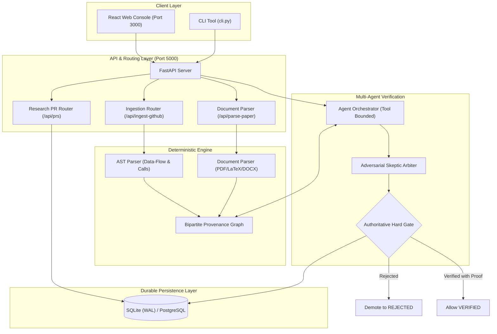

<div align="center">

# 🔬 Radly

**Automated Code-to-Paper Impact Analyzer & Adversarial Skeptic Verifier**

*Map Git diffs directly to downstream scientific impact in research manuscripts with mathematical rigor.*

[](https://github.com/monish250507/Radly/actions/workflows/ci.yml)
[](https://www.python.org/)
[](LICENSE)
[](https://fastapi.tiangolo.com)
[](https://react.dev)
[](https://vitejs.dev)

[Quickstart](#-quickstart) • [Architecture](#-architecture) • [Features](#-core-features) • [Hugging Face Spaces](#-deploy-to-hugging-face-spaces) • [Docker](#-docker-deployment) • [Contributing](CONTRIBUTING.md)

</div>

---

## 💡 Why Radly?

In scientific computing and AI research, a single line change in a training script—such as altering `learning_rate = 1e-4` to `1e-3`, modifying an optimizer, or tweaking a loss function—can completely invalidate the reported results, tables, and theoretical claims in a published paper.

Traditional LLMs hallucinate dependencies when asked to summarize diffs. **Radly replaces guesswork with formal proof**:
1. **Deterministic Code AST Analysis**: Builds data-flow and function call hierarchies without executing untrusted code.
2. **Scientific Document AST**: Extracts manuscript sections, equations, tables, and numerical claims from PDFs, DOCX, and LaTeX.
3. **Bipartite Provenance Graph**: Maps parameters in code directly to numerical claims in paper figures and tables.
4. **Adversarial Skeptic Hard-Gating**: An adversarial AI auditor actively challenges claims. If the Skeptic rejects an inference, it can **never** surface as `VERIFIED`.
5. **Research PRs & Peer Review**: Attach Git diffs to scientific analysis, enabling researchers to review paper impact before code merges.

---

## 🏛 Architecture



---

## ✨ Core Features

- 🧠 **Authoritative Skeptic Hard-Gating**: Adversarial verification guarantees that unproven or rejected claims never surface as `VERIFIED`.
- 🔍 **Multi-Hop AST Data-Flow**: Traces variable assignments and call hierarchies across multiple files (`DATA_FLOW`, `CALLS`).
- 📄 **Multi-Format Manuscript Extraction**: Native support for **PDF**, **LaTeX**, **DOCX**, and **TXT** files.
- 🤝 **Scientific Pull Requests**: Review code changes alongside their downstream manuscript impact with peer comments and review verdicts.
- 🔐 **Production JWT & RBAC**: HMAC-SHA256 token verification with 5-tier role hierarchy (`OWNER`, `MAINTAINER`, `RESEARCHER`, `REVIEWER`, `VIEWER`).
- 💾 **Durable Persistence**: Multi-tier architecture supporting local zero-setup SQLite (WAL mode) and production PostgreSQL (`asyncpg`).
- ⚡ **Graceful Degradation**: If external LLM inference is unreachable, the engine gracefully falls back to deterministic static keyword matching with explicit status alerts.

---

## 🚀 Quickstart

### Prerequisites
- Python 3.11 or 3.12
- Node.js 18+ (for frontend)
- Git

### 1. Clone & Setup Environment

```bash
git clone https://github.com/monish250507/Radly.git
cd Radly

# Set up Python virtual environment
python -m venv venv

# Linux / macOS:
source venv/bin/activate

# Windows:
.\venv\Scripts\Activate

# Install dependencies
pip install -r requirements.txt
npm install
```

### 2. Configure Environment Variables

```bash
cp .env.example .env
```
Edit `.env` and set your Groq API key:
```ini
RBR_LLM_API_KEY=gsk_your_groq_api_key_here
RBR_LLM_MODEL=openai/gpt-oss-120b
```

### 3. Run Database Migrations

```bash
python infra/migrate.py
```

### 4. Start Development Servers

You can start both backend and frontend concurrently:
```bash
npm run dev
```
Or start them independently:
```bash
# Terminal 1: Backend API
python -m uvicorn server.main:app --host 0.0.0.0 --port 5000 --reload

# Terminal 2: Frontend UI
npm run client
```

Open your browser at **`http://localhost:3000`**.

---

## 🤗 Deploy to Hugging Face Spaces (100% Free — 16 GB RAM)

Radly is fully tailored for [Hugging Face Spaces](https://huggingface.co/spaces) using Docker:

1. **Create a Space**: Go to [huggingface.co/new-space](https://huggingface.co/new-space), enter a name, choose **Docker** SDK, and select **Blank**.
2. **Push Code**: Push this repository to your Space Git remote or connect your GitHub repository.
3. **Configure Secrets**: In your Space's **Settings** -> **Variables and secrets**, add:
   - `RBR_LLM_API_KEY`: Your Groq API key (`gsk_...`)
   - `RBR_LLM_PROVIDER`: `groq`
   - `RBR_LLM_MODEL`: `openai/gpt-oss-120b` (or `llama-3.3-70b-versatile`)
   - `JWT_SECRET`: A secure 32+ character string
   - *(Optional)* `RBR_DB_URL`: Your free PostgreSQL connection string from [Neon.tech](https://neon.tech)
4. Hugging Face Spaces will automatically build the Docker image, map port `7860`, run database migrations, and serve the application with **2 vCPUs and 16 GB of RAM** at zero cost!

---

## 🐳 Docker Deployment

To launch Radly in a containerized environment locally with a single command:

```bash
docker compose up --build
```
This starts the production container on **`http://localhost:5000`** (or port `7860` if configured) with the built frontend bundled directly into the FastAPI application.

---

## 💻 CLI Usage

Radly includes a standalone, stateless CLI for terminal and CI/CD automation:

```bash
# Ingest a public repository
python cli.py ingest https://github.com/karpathy/nanoGPT

# Analyze impact of the latest commit
python cli.py analyze HEAD~1..HEAD

# Submit for PR analysis
python cli.py pr create --repo https://github.com/karpathy/nanoGPT --branch feature-lr
```

---

## 📡 API Reference

| Method | Endpoint | Description | Auth Required |
| :--- | :--- | :--- | :--- |
| `GET` | `/api/health` | Service health and LLM configuration status | No |
| `POST` | `/api/ingest-github` | Ingest GitHub repo URL or upload code files for AST parsing | No |
| `POST` | `/api/parse-paper` | Parse manuscript buffer (PDF / LaTeX / DOCX / TXT) into AST | No |
| `POST` | `/api/analyze-impact` | Run blast radius analysis with Agent Orchestrator & Skeptic | No |
| `GET` | `/api/prs` | List Research PRs | Bearer JWT (Viewer+) |
| `POST` | `/api/prs` | Create a new Research PR with background impact analysis | Bearer JWT (Researcher+) |
| `GET` | `/api/prs/{id}` | Get Research PR status, diff summary, comments, and reviews | Bearer JWT (Viewer+) |
| `POST` | `/api/prs/{id}/comments` | Add a comment to a Research PR | Bearer JWT (Viewer+) |
| `POST` | `/api/prs/{id}/review` | Submit review verdict (`APPROVED`, `REJECTED`, `MERGED`) | Bearer JWT (Reviewer+) |

---

## 🧪 Running Tests

Radly features an extensive test suite covering unit logic, AST parsing, integration contracts, and stress/concurrency resilience:

```bash
# Run complete test suite (127+ tests)
pytest server/tests/ -v

# Run specific test suites
pytest server/tests/test_bulletproof.py -v         # Concurrency, edge cases & security
pytest server/tests/test_skeptic_gating.py -v      # Skeptic hard-gating verification
pytest server/tests/test_durable_persistence.py -v # SQLite durability across restarts
pytest server/tests/test_auth.py -v                # JWT claim validation & RBAC
```

---

## 🤝 Contributing

We welcome contributions from the scientific computing and open-source communities!
Please see our [CONTRIBUTING.md](CONTRIBUTING.md) guide for instructions on setting up your environment, running tests, and submitting PRs.

---

## 📜 License

Radly is licensed under the [MIT License](LICENSE).
